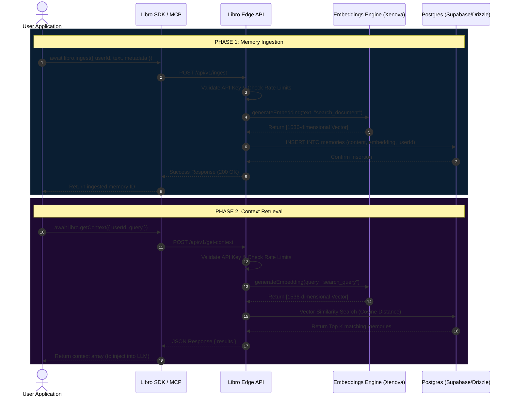

# Libro Architecture & Flow

This document outlines the detailed sequence from memory ingestion (`/ingest`) to context retrieval (`/fetch` or `getContext`).

## End-to-End System Flow

```mermaid
sequenceDiagram
    autonumber
    
    actor User as User Application
    participant SDK as Libro SDK / MCP
    participant API as Libro Edge API
    participant Emb as Embeddings Engine (Xenova)
    participant DB as Postgres (Supabase/Drizzle)

    %% INGESTION PHASE
    rect rgb(10, 30, 50)
    Note over User, DB: PHASE 1: Memory Ingestion
    User->>SDK: await libro.ingest({ userId, text, metadata })
    SDK->>API: POST /api/v1/ingest
    API->>API: Validate API Key & Check Rate Limits
    API->>Emb: generateEmbedding(text, "search_document")
    Emb-->>API: Return [1536-dimensional Vector]
    API->>DB: INSERT INTO memories (content, embedding, userId)
    DB-->>API: Confirm Insertion
    API-->>SDK: Success Response (200 OK)
    SDK-->>User: Return ingested memory ID
    end

    %% RETRIEVAL PHASE
    rect rgb(30, 10, 50)
    Note over User, DB: PHASE 2: Context Retrieval
    User->>SDK: await libro.getContext({ userId, query })
    SDK->>API: POST /api/v1/get-context
    API->>API: Validate API Key & Check Rate Limits
    API->>Emb: generateEmbedding(query, "search_query")
    Emb-->>API: Return [1536-dimensional Vector]
    API->>DB: Vector Similarity Search (Cosine Distance)
    DB-->>API: Return Top K matching memories
    API-->>SDK: JSON Response { results }
    SDK-->>User: Return context array (to inject into LLM)
    end
```
