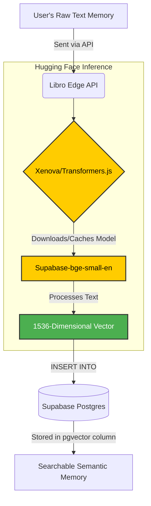
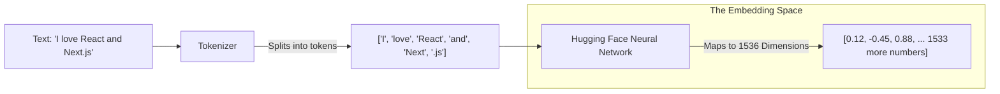
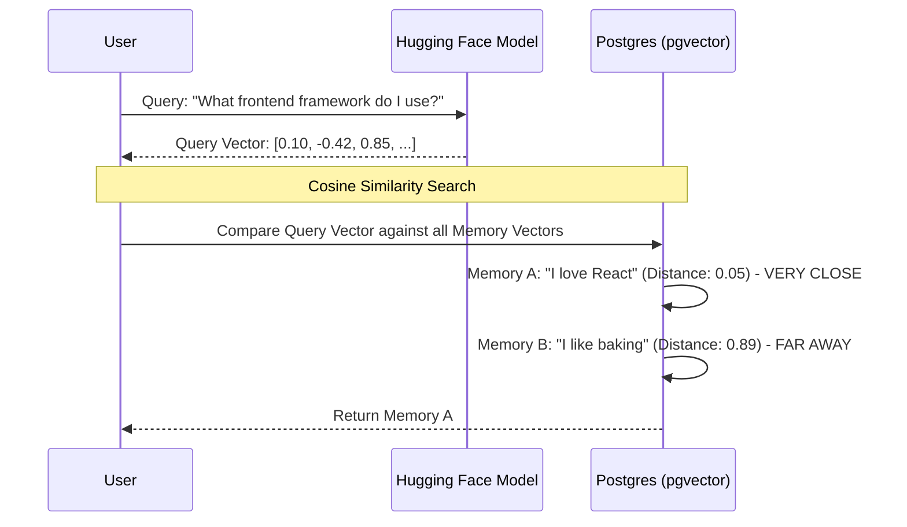

# Understanding Embeddings in Libro

Libro uses **Vector Embeddings** to power its semantic memory engine. But what exactly is an embedding, and how does Hugging Face fit into the picture? This document breaks down the process from complex architecture to basic concepts.

## 1. The High-Level Architecture (How it fits together)

When you send a text memory to Libro, we don't just store the text. We convert it into a vector using a Hugging Face model running directly on our Edge API.

### The Role of Hugging Face (Xenova/Transformers)
- **Hugging Face** is the premier open-source hub for AI models.
- **Xenova/Transformers.js** is a library that allows us to run Hugging Face models *directly in Node.js/Edge environments* without needing a massive external Python server.
- **The Model:** We use a specialized embedding model (e.g., `Supabase/gte-small` or `bge-small-en`) hosted on Hugging Face. Transformers.js downloads the model weights and converts your text into numbers instantly.

---

## 2. The Vectorization Process (How text becomes math)

How does text turn into a "Vector"? The embedding model acts as a massive dictionary of meaning, not just words. 

Every dimension (number) in that array represents a subtle, abstract concept that the AI learned during training.

---

## 3. Semantic Search (How we find memories)

When a user asks a question, we don't look for exact word matches (like traditional SQL `LIKE '%React%'`). Instead, we calculate the "distance" between the question's vector and all the stored memory vectors.

### The Basics: What is Cosine Similarity?
Imagine a 2D graph.
- Point A (Memory): `[1, 2]`
- Point B (Query): `[1, 2.1]`
Because the arrows pointing to A and B are pointing in almost the exact same direction, the angle between them is tiny. A tiny angle means they are **semantically similar**. 
Libro does this exact math, just in 1,536 dimensions instead of 2!
