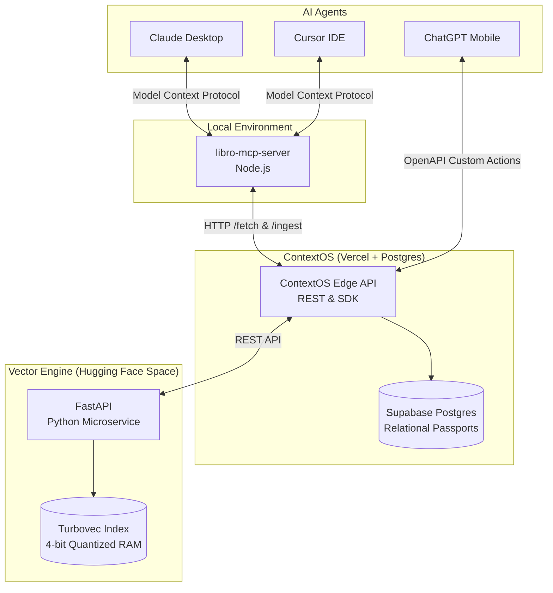

# ContextOS (Libro Hive Mind) 🧠

ContextOS is the persistent memory layer for AI Agents. It provides a multi-tenant "Hive Mind" that syncs your context across tools like Claude Desktop, Cursor, and ChatGPT. Stop pasting the same architectural decisions into your prompts—tell ContextOS once, and all your agents will know it forever.

---

## 🏗️ Architecture

ContextOS connects your local AI environments to a persistent cloud database using the Model Context Protocol (MCP) and REST APIs. It is backed by a bleeding-edge vector engine powered by Google's TurboQuant algorithm.



---

## 🏎️ Benchmarks & Competitor Analysis

Libro provides enterprise-grade, memory-dense vector retrieval at a fraction of the latency and infrastructure cost of standard managed solutions like **Mem0** and **Zep**. By running our vector engine directly in RAM via **Turbovec (4-bit quantization)**, we eliminate network round-trips to heavy managed databases like Qdrant or Pinecone.

### Network Latency & Footprint (10M Vector Scale)

| Framework | P90 Retrieval (ms) | Storage Engine | Memory Footprint (10M) | Self-Host Difficulty |
| :--- | :--- | :--- | :--- | :--- |
| **Libro (Turbovec)** | **~336 ms** | **In-Memory SIMD** | **4 GB (4-bit quant)** | **Easy (Serverless HF Space)** |
| **Mem0 (Embedchain)** | ~240 ms (DB network hop) | Managed Vector DB | 31 GB (Float32) | Medium (Requires Docker DBs) |
| **Zep** | ~450 ms | Relational / Graph | 50+ GB (Nodes+Edges) | Hard (Enterprise Focus) |
| **LangMem** | ~180 ms | Bring Your Own DB | Varies heavily | Easy (Library Only) |

### Why Libro Wins
1. **The Mem0 Bottleneck (Network I/O):** Mem0 defaults to managed vector databases (like Qdrant). Every memory recall requires a network hop taking 50-100ms *just for the database query*. Libro's Turbovec engine keeps the index directly in RAM, reducing retrieval latency to purely the HTTP request overhead.
2. **The Zep Bottleneck (Graph Complexity):** Zep uses a temporal knowledge graph over Postgres, requiring massive database storage. Libro achieves a similar graph using lightweight relational 'Passports'.
3. **Storage & Scale:** Mem0 and LangMem rely on Float32 embeddings (31 GB of RAM for 10M memories). Libro uses TurboQuant compression, fitting 10M vectors into just 4 GB of RAM while speeding up SIMD scan times by 20% compared to standard FAISS.

---

## 🚀 Getting Started

To give your AI agent persistent memory, you need your unique **User ID** and an **API Key**. Sign up or log into the dashboard at [libro.co.in](https://libro.co.in) (using GitHub) to get your credentials.

---

## 🛠️ 1. Using the MCP Server (For Claude & Cursor)

The Model Context Protocol (MCP) allows local AI agents to seamlessly access the Libro Hive Mind.

### Installation & Configuration

For **Claude Desktop**, open your configuration file:
* Mac: `~/Library/Application Support/Claude/claude_desktop_config.json`
* Windows: `%APPDATA%\Claude\claude_desktop_config.json`

Add the `libro` server:

```json
{
  "mcpServers": {
    "libro": {
      "command": "npx",
      "args": [
        "-y",
        "libro-mcp-server@latest"
      ],
      "env": {
        "LIBRO_API_KEY": "your_api_key_here",
        "LIBRO_USER_ID": "your_user_id_here"
      }
    }
  }
}
```

### Usage in Chat

Once installed, simply restart Claude or Cursor. Because of our strict privacy controls, the agent will **not** automatically save your data. 

To use your Hive Mind, tell your agent to use the following manual commands:
* **`/ingest [text]`** - Saves a new memory to your database. (e.g. `/ingest Our project codename is Apollo.`)
* **`/fetch [query]`** - Retrieves relevant memories and injects them into the chat. (e.g. `/fetch What is the project codename?`)

---

## 🤖 2. Using ChatGPT Custom GPTs (For Mobile & Web)

You can bring your Hive Mind to the ChatGPT iOS/Android app by creating a Custom Action.

1. Create a new Custom GPT.
2. In the **Instructions**, add: *"To save memories, call ingestMemory. To retrieve context, call getContext. Use endUserId: 'your_user_id_here'"*
3. Create a **New Action** and paste our OpenAPI Schema.
4. Set the Authentication to **API Key**, Auth Type **Bearer**, and paste your `LIBRO_API_KEY`.

---

## 📦 3. Using the `@libro/sdk` (For Next.js / Node.js)

If you are building your own application, you can use our official SDK.

### Installation

```bash
npm install @libro/sdk
```

### Usage

```typescript
import { LibroClient } from "@libro/sdk";

const client = new LibroClient({
  apiKey: "your_api_key_here"
});

// 1. Save a new memory
await client.ingestMemory({
  userId: "your_user_id_here",
  text: "The new UI uses a dark mode palette."
});

// 2. Retrieve context
const context = await client.getContext({
  userId: "your_user_id_here",
  query: "What is the UI palette?"
});

console.log(context.context); 
// Outputs: "[Memory 1] The new UI uses a dark mode palette."
```

---

## 🔌 4. Core REST API

If you aren't using the SDK, you can call the API directly using `curl` or `fetch`.

**Base URL:** `https://www.libro.co.in/api/v1`
**Authentication:** `Authorization: Bearer <YOUR_API_KEY>`

### POST `/ingest`
Saves a new piece of context.
```bash
curl -X POST https://www.libro.co.in/api/v1/ingest \
  -H "Authorization: Bearer libro_sk_..." \
  -H "Content-Type: application/json" \
  -d '{"userId": "123", "text": "My preferred language is TypeScript."}'
```

### POST `/get-context`
Searches the vector database for the most relevant memories.
```bash
curl -X POST https://www.libro.co.in/api/v1/get-context \
  -H "Authorization: Bearer libro_sk_..." \
  -H "Content-Type: application/json" \
  -d '{"endUserId": "123", "query": "What language do I like?"}'
```

### POST `/update`
Updates an existing memory.
```bash
curl -X POST https://www.libro.co.in/api/v1/update \
  -H "Authorization: Bearer libro_sk_..." \
  -H "Content-Type: application/json" \
  -d '{"userId": "123", "memoryId": "uuid-here", "text": "New text"}'
```

### POST `/forget`
Deletes a specific memory from the Hive Mind.
```bash
curl -X POST https://www.libro.co.in/api/v1/forget \
  -H "Authorization: Bearer libro_sk_..." \
  -H "Content-Type: application/json" \
  -d '{"userId": "123", "memoryId": "uuid-here"}'
```
